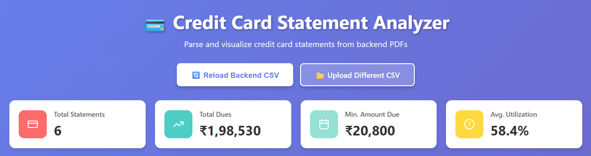
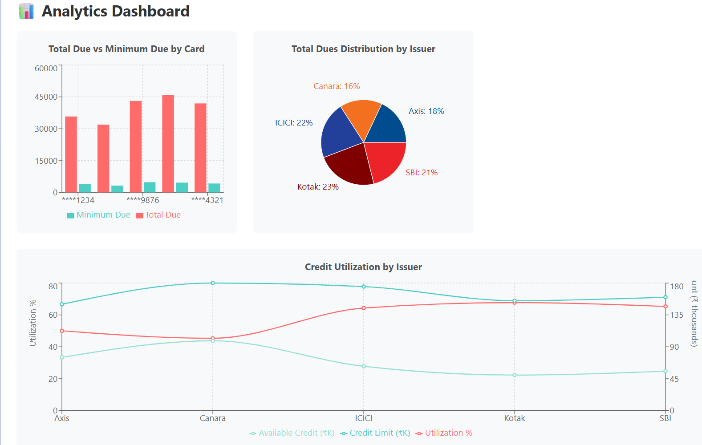
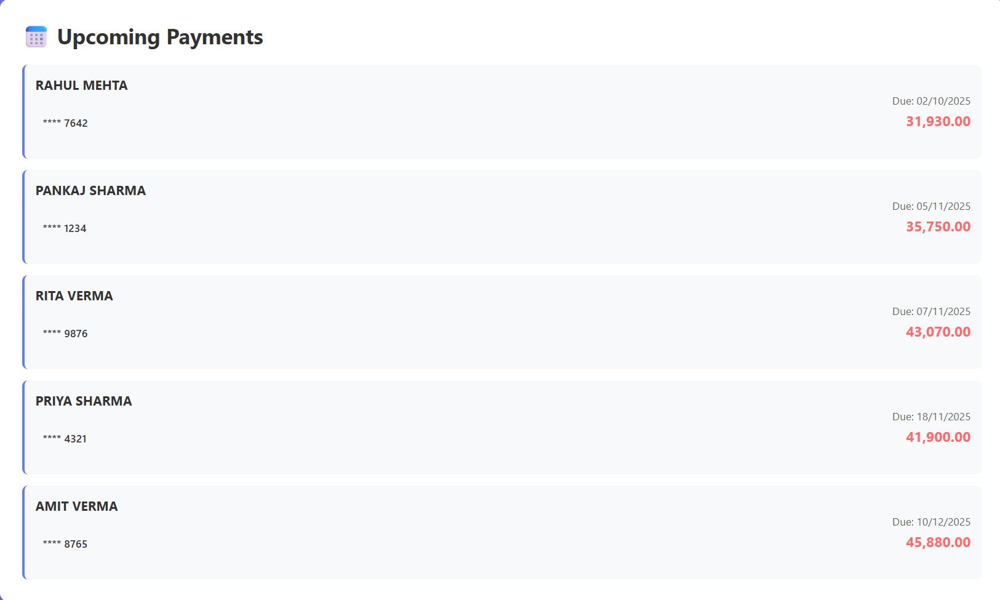
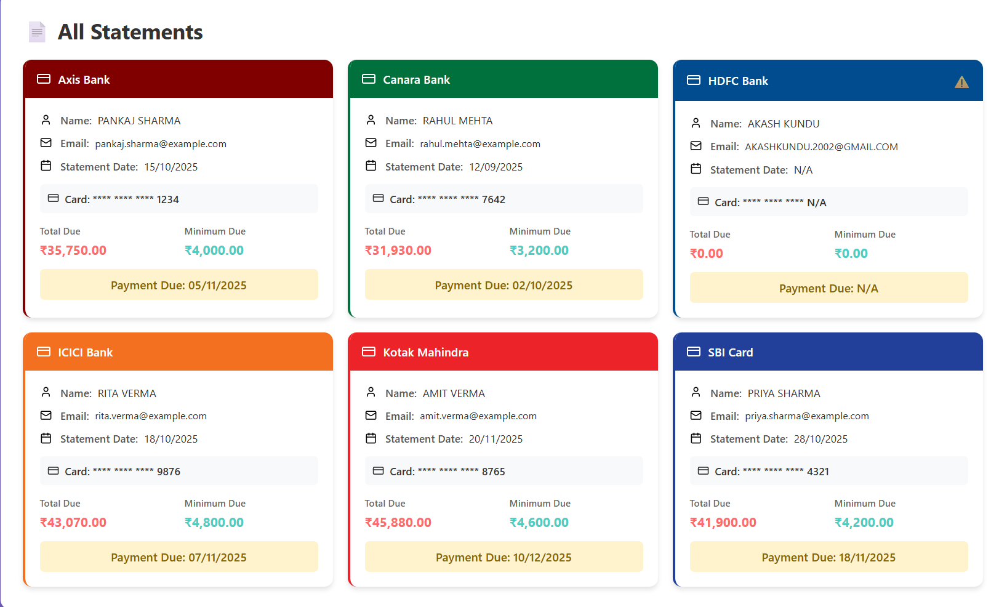

# 💳 Credit Card Statement Analyzer

A **responsive web application** to parse, visualize, and analyze credit card statements from multiple banks. This project includes a **Python Flask backend** for parsing PDFs and a **React frontend** for displaying analytics, charts, and detailed statement information.

---

## **Table of Contents**

1. [Project Overview](#project-overview)
2. [Features](#features)
3. [Folder Structure](#folder-structure)
4. [Backend Setup](#backend-setup)
5. [Frontend Setup](#frontend-setup)
6. [Screenshots](#screenshots)
7. [Usage](#usage)
8. [Notes](#notes)

---

## **Project Overview**

This project helps users **analyze credit card statements from multiple banks** by:

- Automatically parsing PDF statements using **regex** and **OCR** (for scanned PDFs).
- Generating a consolidated CSV of all statements.
- Visualizing financial data with **charts** (Bar, Pie, Line).
- Providing **summary cards** and **upcoming payment alerts**.
- Displaying individual **statement cards** with detailed information in a modal.

The frontend is **responsive**, making it accessible on desktops, tablets, and mobile devices.

---

## **Features**

- ✅ Parse multiple bank PDFs (text-based or scanned)
- ✅ Extract fields: Name, Email, Card Last 4 Digits, Statement Date, Payment Due Date, Total & Minimum Dues, Credit Limit, Available Credit
- ✅ Consolidated CSV output for all parsed statements
- ✅ Interactive charts:

  - Bar Chart: Total vs Minimum Due
  - Pie Chart: Total Dues distribution by bank
  - Line Chart: Credit Utilization trends

- ✅ Summary cards with key statistics
- ✅ Upcoming payments list, sorted by due date
- ✅ Statement cards with modal view for details
- ✅ Responsive layout for all devices

---

## **Folder Structure**

```
Credit Card Parser/
│
├── backend/
│   ├── credit_parser.py
│   ├── parsed_credit_statements.csv
│   └── statements/
│       ├── Axis Bank Statement.pdf
│       ├── HDFC Bank Statement.pdf
│       └── ... (other banks)
│
└── frontend/
    ├── src/
    │   ├── components/
    │   │   ├── Dashboard.js
    │   │   ├── Charts.js
    │   │   └── StatementCard.js
    │   ├── App.js
    │   ├── App.css
    │   └── index.js
    └── package.json
```

---

## **Backend Setup**

1. Navigate to the backend folder:

```bash
cd backend
```

2. Install dependencies:

```bash
pip install flask flask-cors pandas pdfplumber pytesseract pdf2image
```

3. Configure paths for Tesseract and Poppler:

```python
TESSERACT_PATH = r"C:\Program Files\Tesseract-OCR\tesseract.exe"
POPPLER_PATH = r"C:\path\to\poppler\bin"
```

4. Run the Flask server:

```bash
python credit_parser.py
```

- Backend runs on `http://localhost:5000`
- `/parse` endpoint generates CSV
- `/parsed_credit_statements.csv` serves the parsed data

---

## **Frontend Setup**

1. Navigate to the frontend folder:

```bash
cd frontend
```

2. Install dependencies:

```bash
npm install
```

3. Start the React app:

```bash
npm start
```

- App runs on `http://localhost:3000`
- Connects to backend to fetch CSV and display dashboards

---

## **Screenshots**

**Dashboard Overview**


**Charts Section**


**Upcoming Payments & Modal View**


**Statement Cards**


---

## **Usage**

1. Place your PDF statements in `backend/statements/`.
2. Start the backend server (`credit_parser.py`).
3. Open frontend (`npm start`).
4. Dashboard automatically fetches and displays analytics.
5. Optional: Upload a different CSV using the upload button.
6. Click on a statement card to view full details in a modal.

---

## **Notes**

- Handles both **text-based** and **scanned PDFs**.
- Missing fields in statements are handled gracefully (`N/A`).
- Bank colors and charts are dynamically assigned based on **bank name** in filename.
- CSV is the single source of truth for frontend display.
